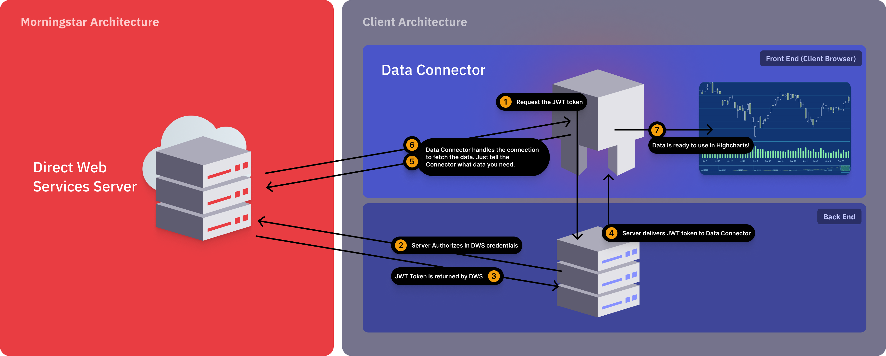

<!-- llms
description: install (npm / UMD / CDN), authentication, regional settings, and using pre-fetched JSON instead of live calls
-->

# Morningstar Connectors

With the **Highcharts Connectors** for the **Morningstar Direct Web Services**
you can access finance-related information to different kinds of financial
assets. This requires a Highcharts license and a Morningstar subscription.

## Versions

There are two versions of the scripts, and the difference between them is the
Morningstar API they use. The version with the `dws` suffix uses the newer API,
which provides access to the **Investment Details API** and the **Time Series
API**, with more to come in the future.

## Requirements

To use the Morningstar Connectors you need:

- Morningstar credentials (this can be either):
  - Access token from your server
  - Username and password

The connectors ship in two flavours, distinguished by the `dws` suffix. Pick the
one matching the Morningstar API you intend to call (see [Versions](#versions)):

- `connectors-morningstar` - legacy API.
- `connectors-morningstar-dws` - newer DWS API.

## Installation

You can load the connectors in three equivalent ways. Choose whichever best fits
your project setup. Regardless of the loading method, connectors are exposed
through the `HighchartsConnectors.Morningstar.*` and
`HighchartsConnectors.MorningstarDWS.*` namespaces. Whether a connector can
fetch data depends on your API access.

### 1. ES module (recommended for app projects)

Install the package and import the bundle you need. Importing it registers the
connectors with Highcharts as a side effect, and also exposes them through the
imported namespace (shown below) as named exports.

```bash
npm install @highcharts/connectors-morningstar
```

```js
import Highcharts from 'highcharts';
// Legacy API
import * as HighchartsConnectors from '@highcharts/connectors-morningstar';
// DWS API
import * as HighchartsConnectorsDWS from '@highcharts/connectors-morningstar/dws';
```

### 2. UMD bundle through a bundler

If you bundle your app yourself (Webpack, Rollup, esbuild, etc.), point it at
the UMD build distributed inside the package:

```js
// Legacy API
@highcharts/connectors-morningstar/connectors-morningstar.js
// DWS API
@highcharts/connectors-morningstar/connectors-morningstar-dws.js
```

### 3. `<script>` tag from the CDN

For quick prototyping or plain HTML pages, include the UMD bundle directly from
[code.highcharts.com](https://code.highcharts.com):

```html
<script src="https://code.highcharts.com/highcharts.js"></script>
<!-- Legacy API -->
<script src="https://code.highcharts.com/connectors/morningstar/connectors-morningstar.js"></script>
<!-- DWS API -->
<script src="https://code.highcharts.com/connectors/morningstar/connectors-morningstar-dws.js"></script>
```

## Quick Start

The integration of the Morningstar Connectors differs between Highcharts core
products and Highcharts Dashboards.

### Highcharts Quick Start

After loading a bundle (see [Installation](#installation)), you have to manually
create the connector and assign the resulting table to your series options.
Examples of how to use specific connectors can be found below in the
[Available Connectors](#available-connectors) section.

### Highcharts Dashboards Quick Start

After loading a bundle, the Morningstar connectors are registered with the
Dashboards registry automatically and are then available in the data pool as
other connector types.

### Available Connectors

- Direct Web Services:
  - [Investments Details](https://www.highcharts.com/docs/morningstar/dws/investments-details-connector)
  - [Time Series](https://www.highcharts.com/docs/morningstar/dws/time-series-connector)

- Enterprise Components:
  - [Goal Analysis](https://www.highcharts.com/docs/morningstar/goal-analysis)
  - [Risk Score](https://www.highcharts.com/docs/morningstar/risk-score)
  - [Time Series](https://www.highcharts.com/docs/morningstar/time-series/time-series)
  - [X-Ray](https://www.highcharts.com/docs/morningstar/x-ray)
  - [Screener](https://www.highcharts.com/docs/morningstar/screeners/screener)
  - [Security Details](https://www.highcharts.com/docs/morningstar/security-details)
  - [Security Compare](https://www.highcharts.com/docs/morningstar/security-compare)
  - [Performance](https://www.highcharts.com/docs/morningstar/performance)
  - [Hypo Performance](https://www.highcharts.com/docs/morningstar/hypo-performance)

### Morningstar Regions

By default the region of the Morningstar API defaults to the nearest region of
the Morningstar Direct Web Services based on the browser localization settings.
If you would like to change the region that is used for data fetching from the
API, you can define the `url` by setting the `api.url` property to Morningstar
compatible URL.

Example:

```js
  const connector = new HighchartsConnectors.Morningstar.SecurityDetailsConnector({
      api: {
          url: 'https://www.us-api.morningstar.com/',
          access: {
              token: 'your_access_token'
          }
      },
      converters: ['PortfolioHoldings'],
      security: {
          id: 'F0GBR052QA',
          idType: 'MSID'
      },
  });
```

## Architecture

This is a visualization of the Highcharts Morningstar Data Connector:


## Using pre-fetched JSON with `api.json` option

You can bypass API authentication and network requests by passing a json
payload through `api.json` option.

When `api.json` option is set, it has higher priority than `postman` or online
API settings.

```js
const connector = new HighchartsConnectors.Morningstar.SecurityDetailsConnector({
    api: {
        json: [{
            Id: 'SECURITY_ID',
            Isin: 'SECURITY_ISIN',
            Currency: { Id: 'USD' },
            TrailingPerformance: [{
                ReturnType: 'Nav',
                Type: 'DayEnd',
                Return: [{
                    Date: '2026-01-01',
                    TimePeriod: '1M',
                    Value: 1.2
                }]
            }]
        }]
    },
    security: {
        id: 'F0GBR050DD',
        idType: 'MSID'
    },
    converters: ['TrailingPerformance']
});
```

```js
const dwsConnector = new HighchartsConnectors.MorningstarDWS.InvestmentsConnector({
    api: {
        json: {
            AssetAllocationBreakdown: {
                assetAllocationBreakdown: {
                    assetAllocCashPercLong: 4.49556,
                    assetAllocEquityPercLong: 95.50442,
                    canAssetAllocCanadianEquityPercLong: 2.01286,
                    underlyingInstrumentStockPercent: 95.50445
                },
                identifiers: {
                    performanceId: '0P00000FIA'
                },
                metadata: {}
            },
            CountryAndRegionExposure: {
                countryAndRegionalExposureBreakdown: {
                    equityRegionAmericasPercLongRescaled: 55.728,
                    equityRegionNorthAmericaPercLongRescaled: 55.292,
                    equityCountryUnitedStatesPercLongRescaled: 53.18442
                },
                identifiers: {
                    performanceId: '0P00000FIA'
                },
                metadata: {}
            }
        }
    },
    security: {
        id: '0P00000FIA'
    },
    converters: {
        AssetAllocationBreakdown: {},
        CountryAndRegionExposure: {}
    }
});
```
